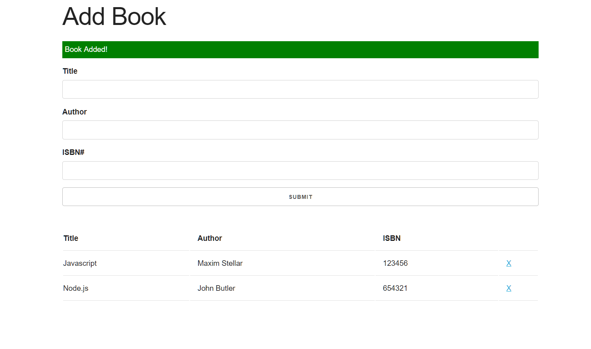
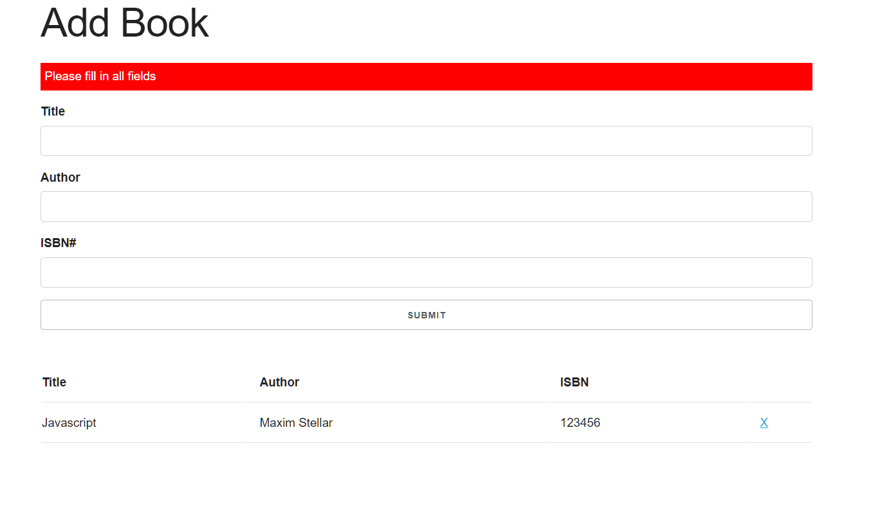

This BookStore app is built with Vanilla_JavaScript using object oriented programming. UI of this app is done with Skeleton css. 
User can add books to list and delete them from list. Validation is implemented for the app. Alerts will be shown on adding and deleting of a book. Local storage api is used to store books on local memory.

To run the project, Download or clone it on your machine and open index.html on your browser.

